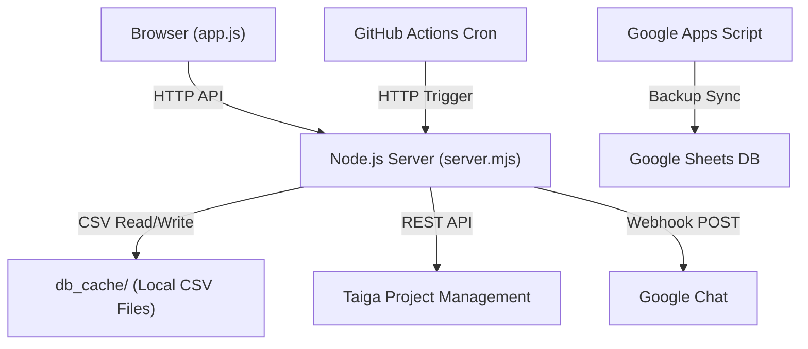
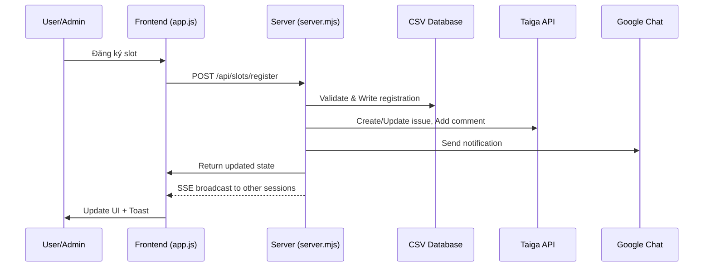

# OT Support Tracking Tool — Functional Requirements Document

> **Phiên bản**: 1.0 — Phân tích từ codebase thực tế  
> **Ngày cập nhật**: 2026-08-24  
> **Dự án**: Amaze OT Support Tracking Tool  
> **Công ty**: Kyanon Digital

---

## 1. Tổng Quan Hệ Thống

### 1.1 Mục Tiêu
Xây dựng ứng dụng web nội bộ để quản lý đăng ký lịch trực OT (Overtime Support) cuối tuần và ngày lễ cho dự án Amaze, với các chức năng: đăng ký ca trực, quản lý lịch, xuất Excel, thông báo tự động qua Google Chat, và tích hợp đồng bộ dữ liệu với Taiga.

### 1.2 Đối Tượng Sử Dụng

| Vai trò | Mô tả |
|---------|-------|
| **ADMIN** | Quản trị viên hệ thống — quản lý user, lịch trực, phê duyệt yêu cầu, cấu hình hệ thống |
| **MEMBER** | Thành viên dự án — đăng ký/hủy ca trực, xem dashboard, gửi yêu cầu cập nhật giờ |

### 1.3 Kiến Trúc Kỹ Thuật

- **Frontend**: Vanilla HTML/CSS/JS (SPA), Chart.js cho biểu đồ thống kê
- **Backend**: Node.js HTTP server (không framework), zero dependencies ngoại trừ `exceljs`
- **Database**: Local CSV files trong `db_cache/`
- **Tích hợp**: Taiga API v1, Google Chat Webhook, GitHub Actions Cron
- **Realtime**: Server-Sent Events (SSE) cho cập nhật trực tiếp giữa các phiên

---

## 2. Chức Năng Xác Thực & Phân Quyền

### FR-AUTH-01: Đăng nhập qua Taiga
- Người dùng đăng nhập bằng tài khoản Taiga (username/email + password)
- Server proxy request đến Taiga Auth API (`POST /api/v1/auth`)
- Chỉ chấp nhận tài khoản có email thuộc domain `@kyanon.digital` (cấu hình qua setting `company_domain`)
- Nếu xác thực thành công, server tạo JWT token (`HS256`) và set vào cookie `session_token` (HttpOnly, SameSite=Lax, 30 ngày)

### FR-AUTH-02: Phân quyền dựa trên vai trò
- Vai trò được xác định từ 2 nguồn: email admin trong DB settings (`admin_email`) và trường `role` trong bảng `users`
- Admin mặc định: `hau.nt@kyanon.digital`
- Cookie-based session: mọi API yêu cầu xác thực đều verify JWT token từ cookie
- Fetch interceptor phía client: tự động logout khi nhận response 401

### FR-AUTH-03: Đăng xuất
- Xóa cookie `session_token` bằng cách set `Max-Age=0`
- Xóa session khỏi `localStorage`

### FR-AUTH-04: Bảo vệ Admin
- Tài khoản admin chính (`hau.nt@kyanon.digital`) không thể bị xóa hoặc deactivate

---

## 3. Quản Lý Lịch Trực (Schedule Management)

### FR-SCHED-01: Tự động tạo ca trực cuối tuần
- Khi truy cập một tháng, hệ thống tự động tạo slot cho tất cả ngày **Thứ 7** và **Chủ Nhật** của tháng đó
- Mỗi slot tự động có:
  - `slot_type`: `WEEKEND`
  - `title`: "Weekend Support"
  - `status`: `OPEN`
  - Capacity mặc định: 1 người, role `QC/PO`, 8 giờ/người, man-month factor = 1
- Không tạo trùng nếu slot đã tồn tại hoặc ngày đó đã được cấu hình là Holiday/Tết

### FR-SCHED-02: Cấu hình ngày lễ / Tết (Admin)
- Admin tạo holiday/Tết bằng khoảng ngày (startDate → endDate)
- Trường yêu cầu: tên ngày lễ, loại (`HOLIDAY` / `TET`), vai trò, số người cần, giờ/người, man-month factor
- Hệ thống expand thành từng ngày riêng lẻ, tạo slot + capacity tương ứng
- Nếu ngày lễ trùng ngày cuối tuần đã tạo, setting Holiday **ghi đè** lên (override slot type, title, capacity)
- Holiday/Tết slot có thể chứa nhiều người đăng ký (capacity > 1)
- Man-month factor được chia đều cho số người đăng ký active

### FR-SCHED-03: Trạng thái Slot

| Trạng thái | Ý nghĩa |
|------------|---------|
| `OPEN` | Còn chỗ đăng ký |
| `FULL` | Đã đủ số người yêu cầu |
| `CLOSED` | Đã đóng (manual) |
| `CANCELLED` | Đã hủy |

- Trạng thái tự động cập nhật khi đăng ký/hủy đăng ký (OPEN ↔ FULL)

### FR-SCHED-04: Đồng bộ với Taiga
- Khi tạo holiday, hệ thống tạo issue trên Taiga với subject: `[OT-SLOT] YYYY-MM-DD | <tên>`
- Custom attributes trên Taiga: `slot_type`, `hours`, `man_month_factor`
- Khi cập nhật holiday, hệ thống cập nhật attributes trên issue Taiga tương ứng

---

## 4. Đăng Ký Ca Trực (Registration)

### FR-REG-01: Đăng ký slot (Member)
- Member click vào slot trên Dashboard calendar → popup xác nhận → đăng ký
- **Validation rules**:
  - User phải `ACTIVE`
  - Slot phải `OPEN` (còn chỗ)
  - Member chỉ được đăng ký **1 ngày trực / tháng** (cho slot WEEKEND)
  - Không được đăng ký ngày đã qua (trừ Admin)
- Đăng ký tự động approved (`AUTO_APPROVED`)
- Sau khi đăng ký: cập nhật slot status, ghi audit log, sync assignee lên Taiga, gửi thông báo Google Chat

### FR-REG-02: Đăng ký thay mặt member (Admin)
- Admin có thể đăng ký slot cho bất kỳ member nào, kể cả ngày đã qua
- `approved_status` = `ADMIN_APPROVED`, `source` = `admin_assignment`
- Không áp dụng giới hạn 1 ngày/tháng cho Admin

### FR-REG-03: Hủy đăng ký
- **Member**: chỉ hủy slot của chính mình, chỉ hủy slot tương lai
- **Admin**: hủy bất kỳ đăng ký nào, kể cả ngày đã qua
- Khi hủy: set `status` = `CANCELLED`, cập nhật slot status, ghi audit log, unassign trên Taiga, gửi thông báo Google Chat

### FR-REG-04: Đổi ca trực / Swap (Admin)
- Admin chọn slot → chọn người hiện tại (fromEmail) → chọn người mới (toEmail)
- Hệ thống: hủy đăng ký cũ + tạo đăng ký mới với `source` = `admin_swap`
- Cập nhật assignee trên Taiga, gửi thông báo Google Chat

### FR-REG-05: Thông báo Google Chat khi đăng ký
- **Đăng ký**: `✅ *Đăng ký ca trực* 👤 <tên> 📅 Ngày: <ngày> 📌 Ca: <ca>`
- **Hủy**: `❌ *Hủy đăng ký ca trực* 👤 <tên> 📅 Ngày: <ngày> 👤 Hủy bởi: <admin>`
- **Swap**: `🔄 *Đổi ca trực* 📅 Ngày: <ngày> 👤 Từ: <A> → <B> 👤 Admin: <admin>`

### FR-REG-06: SSE Broadcast
- Mọi hành động đăng ký/hủy/swap đều broadcast event qua SSE (`/api/events`)
- Các tab/session khác nhận event và tự động cập nhật UI realtime

---

## 5. Yêu Cầu Cập Nhật Giờ (Update Requests)

### FR-UR-01: Tạo yêu cầu (Member)
- Khi member cần điều chỉnh giờ trực thực tế (so với quy định 8h), tạo update request
- Trường: ngày trực, số giờ thực tế, lý do, link evidence/ghi chú
- Request mới có `status` = `PENDING`
- Sync comment lên Taiga issue: `[UPDATE-REQUEST]`
- Gửi thông báo Google Chat cho team

### FR-UR-02: Phê duyệt / Từ chối (Admin)
- Admin xem danh sách requests → Approve / Reject
- Khi **Approve**: cập nhật `hours` trên Taiga custom attributes
- Khi **Reject**: thêm comment `[UPDATE-REJECTED]` trên Taiga
- Ghi audit log + gửi thông báo kết quả qua Google Chat

### FR-UR-03: Phê duyệt hàng loạt (Admin)
- API `POST /api/update-requests/bulk-review` cho phép duyệt/từ chối nhiều request cùng lúc
- Chỉ xử lý các request có `status` = `PENDING`

### FR-UR-04: Filter requests
- Phía client hỗ trợ lọc theo status: `ALL` | `PENDING` | `APPROVED` | `REJECTED`

---

## 6. Dashboard & Giao Diện

### FR-UI-01: Register Dashboard
- **Calendar view**: hiển thị tháng, mỗi ô ngày hiển thị slot type (badge màu), tên người đăng ký, trạng thái remaining slots
- **Table view**: danh sách các slot trong tháng với đầy đủ thông tin
- **Navigation**: chuyển tháng bằng phím tắt `←` `→` hoặc nút prev/next
- **Filter**: lọc slot theo trạng thái (`ALL`, `OPEN`, `FULL`)
- **Toolbar**: Refresh DB, Export Excel, chọn khoảng tháng export

### FR-UI-02: Statistics Page
- Biểu đồ Chart.js hiển thị thống kê theo tháng/nhiều tháng
- **Per-user stats**: số ngày trực, tổng giờ, man-month contribution
- **Type breakdown**: phân bổ theo WEEKEND / HOLIDAY / TET
- API `GET /api/stats?months=YYYY-MM,YYYY-MM,...`

### FR-UI-03: My Profile Page
- Thông tin cá nhân: email, display name, role, status
- Lịch sử đăng ký, giờ đã trực, man-month tích lũy

### FR-UI-04: Update Requests Page
- Danh sách yêu cầu cập nhật giờ
- Nút tạo request mới (cho member)
- Nút approve/reject (cho admin), hỗ trợ bulk select

### FR-UI-05: Admin — User Management (Admin only)
- Danh sách users với search/filter
- **Thêm user**: email `@kyanon.digital`, display name, role
  - Tự động tạo membership trên Taiga
- **Deactivate/Reactivate user**: set status `ACTIVE` ↔ `INACTIVE`
  - Không cho deactivate admin chính
- **Hard delete**: chỉ khi user không có registrations, update requests, hay audit logs

### FR-UI-06: Admin — Schedule Setup (Admin only)
- Xem / quản lý schedule slots theo tháng
- Tạo holiday/Tết (date range)
- Cấu hình capacity per slot

### FR-UI-07: Dark Mode
- Toggle dark/light theme qua nút trên topbar
- Preference lưu trong `localStorage` (`ot-dark-mode`)

### FR-UI-08: Responsive Design
- Sidebar responsive: hamburger menu trên mobile
- Sidebar overlay cho màn hình nhỏ

### FR-UI-09: Toast Notifications
- Thông báo nổi (toast) cho các thao tác thành công/thất bại
- Auto-dismiss sau 3 giây

---

## 7. Export Excel

### FR-EXP-01: Xuất Excel theo tháng
- API: `GET /api/export?month=YYYY-MM[&toMonth=YYYY-MM]`
- Sử dụng template Excel có sẵn: [AMAZE _ Time log - Overtime - 2026.xlsx](file:///c:/Users/Archer/SC-NEW/OT%20Support%20Tracking%20tool/templates/AMAZE%20_%20Time%20log%20-%20Overtime%20-%202026.xlsx)
- Tạo worksheet mới cho mỗi tháng export (format tên: `MonYYYY`, ví dụ: `Jun2026`)

### FR-EXP-02: Cấu trúc worksheet
- **Row 1**: Total (man-days) — công thức SUM tự động
- **Row 2**: Headers — Date (col A), Username mỗi user (col B trở đi)
- **Row 3+**: Mỗi dòng = 1 slot, giá trị `0.5` (man-day) nếu user đăng ký active, highlight vàng + font đỏ
- Column widths: Date = 20, User = 14

### FR-EXP-03: Export nhiều tháng
- Hỗ trợ range: `month` → `toMonth`, tạo worksheet riêng cho mỗi tháng
- File tải về: `AMAZE_OT_Report_YYYY-MM[_to_YYYY-MM].xlsx`

---

## 8. Thông Báo Google Chat (Notifications)

### FR-CHAT-01: Webhook Configuration
- URL lấy từ: DB setting `google_chat_webhook_url` → env `GOOGLE_CHAT_WEBHOOK_URL` (fallback)
- Admin có thể test webhook: `POST /api/chat/test`

### FR-CHAT-02: Nhắc lịch trực cuối tuần (Friday 17:00 VN)
- Mỗi chiều Thứ 6, gửi 1 tin nhắn tổng hợp lịch trực Thứ 7 + Chủ Nhật
- Nếu có người đăng ký: hiển thị tên + email
- Nếu chưa có: cảnh báo + link đăng ký
- Chống gửi trùng: kiểm tra notification đã gửi trong 12 giờ gần nhất

### FR-CHAT-03: Nhắc ca trực ngày thường
- Ngoài Thứ 6, hệ thống kiểm tra ngày mai có slot không → gửi nhắc nếu có
- 2 loại tin nhắn: có người đăng ký (thông tin chi tiết) và chưa có người (cảnh báo)

### FR-CHAT-04: Nhắc lại sáng Thứ 7 (9:00 AM)
- Nếu ngày Thứ 7 có slot OPEN (chưa ai đăng ký), gửi cảnh báo nhắc lại

### FR-CHAT-05: Tổng kết tháng (Ngày 1 mỗi tháng, 10:00 AM)
- Tự động gửi tổng kết trực tháng trước: tên người — số ngày trực, tổng slot, tổng lượt đăng ký

### FR-CHAT-06: Thông báo sự kiện realtime
- Khi đăng ký/hủy/swap/tạo update request/duyệt request → gửi thông báo tương ứng (xem FR-REG-05, FR-UR-01, FR-UR-02)

### FR-CHAT-07: Gửi lại thông báo (Admin)
- API `POST /api/chat/resend` — admin gửi lại một notification đã lưu

### FR-CHAT-08: Kích hoạt từ bên ngoài
- API `POST /api/chat/trigger-reminders` với `x-cron-token` header hoặc `?token=` query param
- GitHub Actions workflow chạy mỗi Thứ 6 17:00 VN (cron `0 10 * * 5` UTC):
  1. Đánh thức Render service (`/api/health`)
  2. Chờ 60 giây
  3. Gọi trigger reminders API

---

## 9. Tích Hợp Taiga

### FR-TAIGA-01: Xác thực Taiga
- Login bằng username/password → lấy `auth_token`
- Cache token, tự động refresh khi nhận 401
- Fallback: dùng `TAIGA_ADMIN_TOKEN` từ env

### FR-TAIGA-02: Đồng bộ Users
- Lấy memberships từ Taiga project → map thành users trong DB
- Merge: giữ users từ Taiga + giữ users local (source = `admin_app`) chưa có trên Taiga

### FR-TAIGA-03: Đồng bộ Issues → Schedule Slots
- Parse issue subject theo format: `[OT-SLOT] YYYY-MM-DD | <title>`
- Đọc custom attributes: `slot_type`, `hours`, `man_month_factor`
- Đồng bộ assigned user → registration record
- Đọc history comments → parse update requests (`[UPDATE-REQUEST]`, `[UPDATE-APPROVED]`, `[UPDATE-REJECTED]`)
- Đọc comment history → audit logs

### FR-TAIGA-04: Hai chiều sync khi thao tác
- **Đăng ký**: tạo/update issue trên Taiga, set assigned_to, add comment `[REGISTRATION]`
- **Hủy**: unassign, add comment `[REGISTRATION] Cancelled`
- **Swap**: update assigned_to, add comment `[SWAP]`
- **Update request**: add comment `[UPDATE-REQUEST]`
- **Review**: add comment `[UPDATE-APPROVED]` / `[UPDATE-REJECTED]`, update hours attribute
- **Holiday**: tạo issue mới trên Taiga cho mỗi ngày lễ
- **Add user**: tạo membership trên Taiga project

---

## 10. Quản Lý Dữ Liệu (Data Management)

### FR-DATA-01: CSV Database Schema

| Bảng | File | Mô tả |
|------|------|-------|
| `settings` | `settings.csv` | Cấu hình hệ thống (domain, admin email, timezone...) |
| `users` | `users.csv` | Thông tin thành viên và phân quyền |
| `schedule_slots` | `schedule_slots.csv` | Các ngày/ca trực |
| `slot_capacities` | `slot_capacities.csv` | Cấu hình capacity per slot (role, số người, giờ, man-month) |
| `registrations` | `registrations.csv` | Đăng ký trực |
| `holiday_settings` | `holiday_settings.csv` | Cấu hình ngày lễ/Tết |
| `update_requests` | `update_requests.csv` | Yêu cầu cập nhật giờ trực |
| `audit_logs` | `audit_logs.csv` | Nhật ký thao tác |
| `export_jobs` | `export_jobs.csv` | Lịch sử export Excel |
| `chat_notifications` | `chat_notifications.csv` | Lịch sử thông báo Google Chat |

### FR-DATA-02: ID Generation
- Format: `<prefix>_<context>_<identifier>`
- Ví dụ: `slot_2026_06_15`, `cap_2026_06_15_qc_po`, `reg_1719456789_username`, `usr_username`

### FR-DATA-03: State API
- `GET /api/state?month=YYYY-MM[&sync=true]`: load toàn bộ state, filter theo tháng
- Nếu `sync=true` hoặc chưa có data local → trigger full sync từ Taiga
- Tự động ensure month (tạo weekend slots) trước khi trả data
- Response bao gồm: filtered state + session info

### FR-DATA-04: Integrity Rules
- Email phải unique (case-insensitive)
- Capacity check trước khi đăng ký
- One-day-per-month rule cho member
- Audit log cho mọi thao tác quan trọng
- Timestamp format: ISO 8601

---

## 11. Background Jobs & Scheduler

### FR-BG-01: Internal Scheduler
- `setInterval` 30 phút kiểm tra:
  - **17:00 daily**: chạy reminder check (xem FR-CHAT-02, FR-CHAT-03)
  - **Thứ 7, 9:00 AM**: re-reminder cho slot OPEN (xem FR-CHAT-04)
  - **Ngày 1 mỗi tháng, 10:00 AM**: tổng kết tháng (xem FR-CHAT-05)

### FR-BG-02: External Cron (GitHub Actions)
- Workflow file: [google-chat-reminder.yml](file:///c:/Users/Archer/SC-NEW/OT%20Support%20Tracking%20tool/.github/workflows/google-chat-reminder.yml)
- Chạy mỗi Thứ 6, 10:00 UTC (17:00 VN)
- Giải quyết vấn đề Render Free Tier tự động ngủ

---

## 12. Cấu Hình Hệ Thống (Settings)

### FR-SET-01: Settings quản lý bởi Admin
- API: `GET /POST /api/settings` (admin only)
- Các key cấu hình chính:

| Key | Mô tả | Giá trị mặc định |
|-----|--------|-------------------|
| `company_domain` | Domain email cho phép | `kyanon.digital` |
| `admin_email` | Email admin chính | `hau.nt@kyanon.digital` |
| `default_weekend_role` | Role mặc định cho ca cuối tuần | `QC/PO` |
| `default_day_hours` | Số giờ mặc định/ngày | `8` |
| `google_chat_webhook_url` | Webhook URL Google Chat | (cấu hình bởi admin) |
| `app_url` | URL ứng dụng (cho link trong tin nhắn) | (auto-detect từ env) |

---

## 13. API Endpoints

### Xác thực

| Method | Path | Mô tả | Auth |
|--------|------|--------|------|
| `POST` | `/api/auth/login` | Đăng nhập qua Taiga | Public |
| `POST` | `/api/auth/logout` | Đăng xuất | Public |

### State & Data

| Method | Path | Mô tả | Auth |
|--------|------|--------|------|
| `GET` | `/api/state` | Load state theo tháng | Optional |
| `GET` | `/api/health` | Health check | Public |
| `GET` | `/api/events` | SSE real-time events | Public |

### Registration

| Method | Path | Mô tả | Auth |
|--------|------|--------|------|
| `POST` | `/api/slots/register` | Đăng ký ca trực | Session |
| `POST` | `/api/slots/cancel` | Hủy đăng ký | Session |
| `POST` | `/api/slots/swap` | Swap ca (Admin) | Admin |

### Update Requests

| Method | Path | Mô tả | Auth |
|--------|------|--------|------|
| `POST` | `/api/update-requests/create` | Tạo update request | Session |
| `POST` | `/api/update-requests/review` | Duyệt/từ chối request | Admin |
| `POST` | `/api/update-requests/bulk-review` | Duyệt hàng loạt | Admin |

### Admin

| Method | Path | Mô tả | Auth |
|--------|------|--------|------|
| `POST` | `/api/users/add` | Thêm user | Admin |
| `POST` | `/api/users/status` | Thay đổi status user | Admin |
| `POST` | `/api/holidays/create` | Tạo ngày lễ | Admin |
| `GET/POST` | `/api/settings` | Đọc/cập nhật settings | Admin |
| `GET` | `/api/export` | Export Excel | Session |
| `GET` | `/api/stats` | Thống kê nhiều tháng | Public |

### Google Chat

| Method | Path | Mô tả | Auth |
|--------|------|--------|------|
| `POST` | `/api/chat/test` | Test webhook | Admin |
| `POST` | `/api/chat/trigger-reminders` | Kích hoạt nhắc lịch | Admin / Cron Token |
| `POST` | `/api/chat/resend` | Gửi lại notification | Admin |

---

## 14. Menu Visibility (Phân quyền giao diện)

| Menu | ADMIN | MEMBER |
|------|:-----:|:------:|
| Register Dashboard | ✅ | ✅ |
| Statistics | ✅ | ✅ |
| Requests | ✅ | ✅ |
| My Profile | ✅ | ✅ |
| Users (Admin) | ✅ | ❌ |
| Schedule (Admin) | ✅ | ❌ |

---

## 15. Non-Functional Requirements

### NFR-01: Deployment
- Target: Render (free tier)
- Timezone: `Asia/Ho_Chi_Minh`
- Port cấu hình qua env `PORT` (mặc định: 4173)

### NFR-02: Security
- JWT secret cần đổi từ giá trị mặc định (có warning log nếu dùng default)
- Cron API bảo vệ bằng `CRON_TOKEN`
- Cookie HttpOnly chống XSS
- Domain restriction cho login

### NFR-03: Google Apps Script Backup
- File [Code.gs](file:///c:/Users/Archer/SC-NEW/OT%20Support%20Tracking%20tool/apps-script/Code.gs) cung cấp Web App để đọc/ghi state lên Google Sheets
- Sử dụng `LockService` để tránh conflict khi write
- Token-based auth

### NFR-04: Performance
- State API filter data theo tháng để giảm payload
- Audit logs giới hạn 200 entries gần nhất trong response
- SSE cho real-time updates thay vì polling

### NFR-05: Localization
- Tin nhắn Google Chat bằng tiếng Việt (có dấu)
- Giao diện ứng dụng bằng tiếng Anh
- Error messages trong API endpoint bằng tiếng Việt (user-facing)

---

## 16. Data Flow Tổng Hợp

